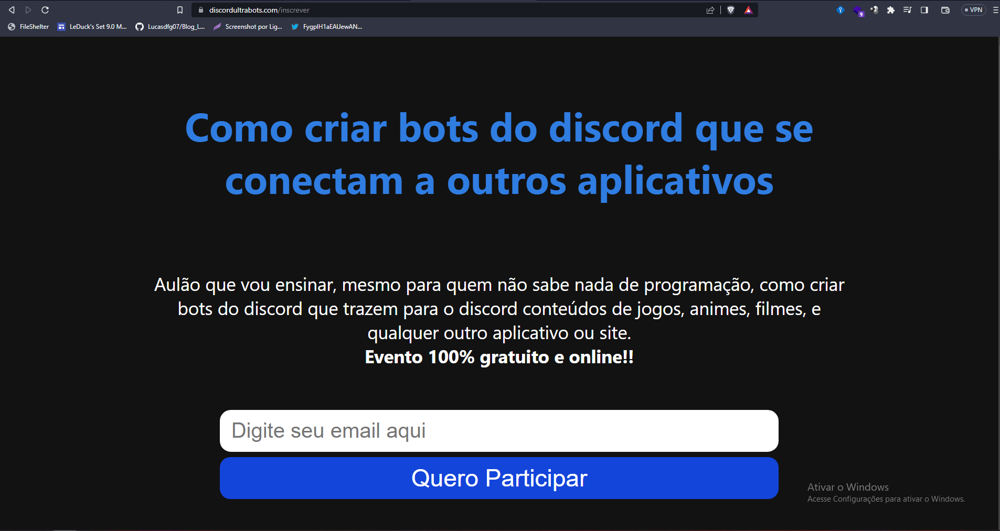
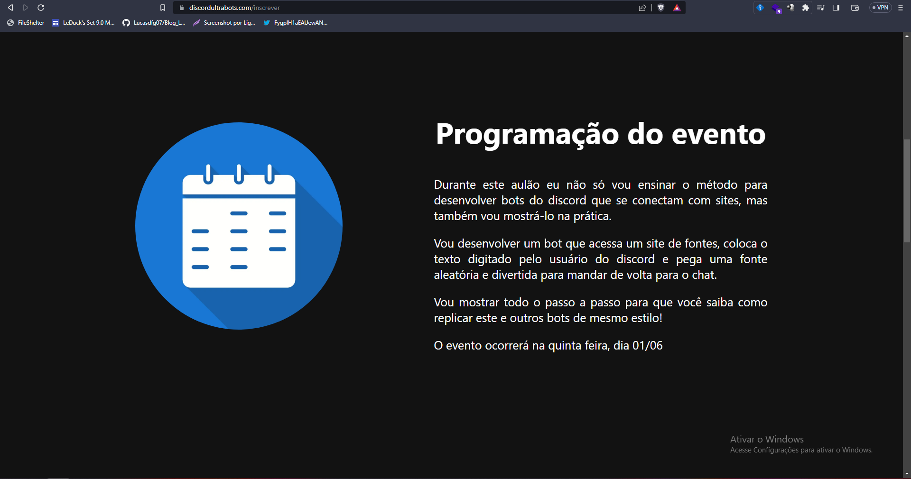
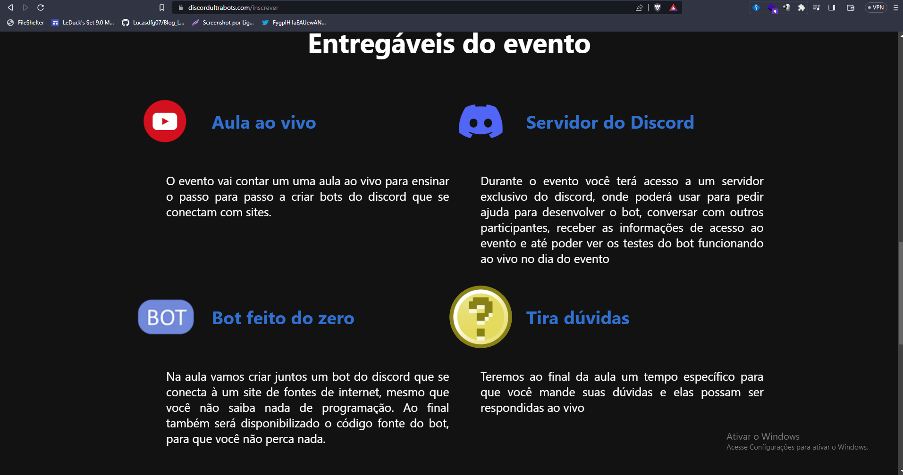
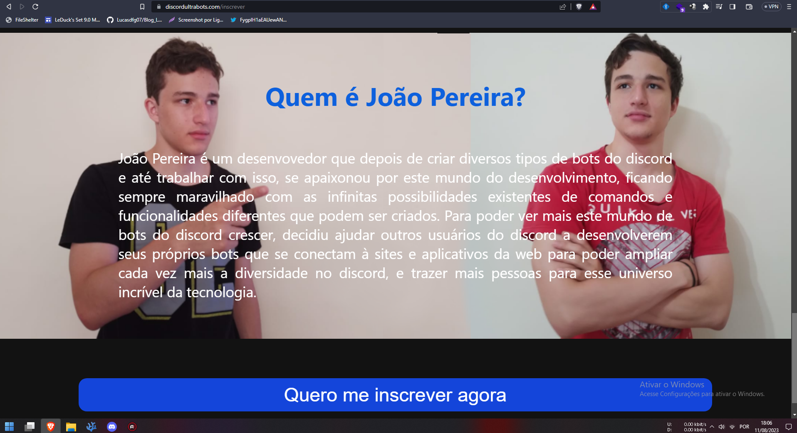
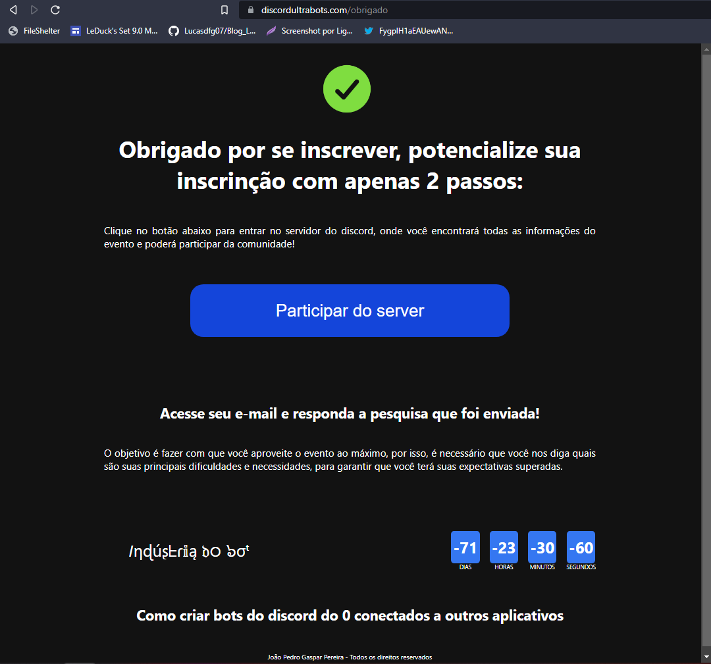

# Digital-Marketing-React-Launch-Site
Um site para capturar leads para um lançamento do marketing digital.
O site foi utilizado para um lançamento de verdade e você pode **acessá-lo clicando no link: https://discordultrabots.com/**

## Tecnologias

Estas são as tecnologias utilizadas no projeto

* React js
* Next js
* Styled components
* Facebook pixel
* Typescript

## Serviços utilizados

* Github
* Mailer Lite
* Rack Nerd VPS

## Getting started

1 - Install dependencies: 

[Install Nodejs](https://nodejs.org/)

2 - Clone the repository running into your terminal:

```sh
git clone https://github.com/ppkat/quizBot-discord.git
```

3 - Install the required libraries using:

```
npm i
```

4 - Run the project with dev mode:
```
npm run dev
```

## Como utilizar

### 1 - Quando você acessar, será automaticamente direcionado para a rota /inscrever, na qual é dividida em 5 seções

### 2 - A primeira delas é a "Call to Action" que seria a chamada para ação, que é exibida como primeira coisa para que o usuário se inscreva no evento o mais rápido possível. Nela há também a promessa sobre o que o lead vai ganhar ao assistir à aula



### 3 - A segunda seção é a programação do evento, que possui uma descrição maior sobre o que será o evento e quando ele vai ocorrer



### 4 - Então temos os entregáveis, onde é exibido todas as coisas que serão entregues durante o evento



### 5 - Nas duas últimas seções temos, respectivamente, a autoridade e o botão para retornar à primeira seção e se inscrever no evento. A seção de autoridade serve para reforçar a autoridade da pessoas que dará a aula, para que gere um pouco de conexão com o visualizador.



### 6 - Ao inserir o seu email e enviar o formulário, você será redirecionado para a página de obrigado e seu email será cadastrado na ferramenta de envio de emails. Nesta página há mais um botão para entrar no grupo do evento, um convite para responder a pesquisa que foi automaticamente enviada para o email cadastrado e um timer que mostra quanto tempo falta para o evento (que no caso está negativo já que a data do evento já passou)



### 7- Por último, também há a página /replay, que mostra tem como primeira seção o replay da aula com um botão logo abaixo que leva direto para a página de vendas do produto que está sendo vendido. Também há seções para falar sobre o bônus e a garantia do produto


### 8 - E claro, todas as páginas são responsivas e são exibidas adequadamente para cada dispositivo


### 9 - Por último, as páginas também possuem o pixel do Facebook instalado para poder contabilizar ações e estudar o comportamento do usuário

  ## Autores

  * **João Pedro Gaspar Pereira** 

  Se gostou do projeto deixe um star, e sugestões são bem-vindas!

  Obrigado por visitar este projeto, espero que você tenha um bom dia e uma ótima vida :)